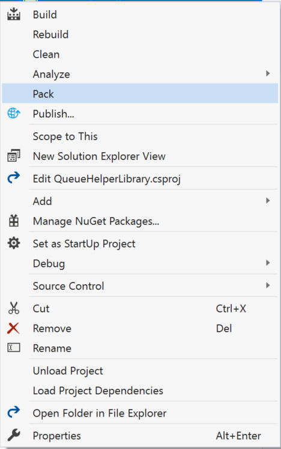

# Using AWS Lambda Layers with .NET Core
## Introduction
In this post we are going to see some techniques on how to create and use Lambda Layers with .NET Core. 
## What is Lambda Layer
Lambda Layer is a feature in AWS Lambda that allows customers to create reusable Lambda components and use them in several Lambda functions without having to deploy the component each time in separate applications.
## When to use Lambda Layers
Some of the use cases for Lambda Layers could be (but not limited to)
1.	Enterprise level reusable business logic components
2.	Generic logging and exception handling components
3.	Common database access components
You get the idea. You can use Lambda layers for any NuGet package that you can reuse across applications. The only caveat is that the package has to be in NuGet package format.
## Support for Lamba Layers in AWS Extensions for .NET CLI
- Install the latest version of the CLI using this command

```
dotnet tool install -g Amazon.Lambda.Tools
```

- If you had it installed already, update it with the following command so you can get the latest features like Lambda Layer support.
```
dotnet tool update -g Amazon.Lambda.Tools
```
## How does Lambda Layers work?
When you package a library as a Lambda Layer, the library gets uploaded to /opt folder in the target Linux environment. Depending on the runtime, libraries are placed in subfolders where runtimes can access. In the case of .NET Core, the libraries are placed under _/opt/dotnetcore/store_ path.

As you might already wonder, how is this possible in .NET where the runtime expects to have all the referenced libraries be available during the application load itself rather than dynamically loading files as needed in other platforms such as Ruby, Python, NodeJS etc. 

Starting .NET Core 2.0, Microsoft introduced a new concept called Runtime Package Store which basically allows us to package and deploy .NET Core applications against a known set of packages that exist in the target environment. When you do this, you no longer have to package components in your application if they are already available in the target environment. This reduces deployment time, better performance and also reduces disk footprint significantly.
See this link for some additional details on this topic - https://docs.microsoft.com/en-us/dotnet/core/deploying/runtime-store

AWS Lambda uses leverages the Runtime Package Store functionality to achieve Lambda Layers functionality. 
## Sample Application using Lambda Layers
We are going to see how to create a sample Lambda Layer, publish to AWS Lambda and also use the Layer in another Lambda function
## Use Case
Let’s assume you had several Lambda functions that were processing Orders for various business use cases and each of these functions were sending messages to an Amazon SQS queue to communicate to other services. While the business logic code will be different across these functions, the actual piece of code that is sending the message to the SQS queue would essentially be the same. In a world without Lambda Layers, you would create a generic library and reference that library in all the Lambda functions to remove redundancy. However, the library/package that you created will be deployed along with every single Lambda function that is processing the orders.

With Lambda Layers, you can avoid the redundant copy situation just by deploying the messaging component as a Lambda Layer and simply using it in all the Lambda functions that need the functionality.

## Prerequisites
## Development Environment Setup
- Install Visual Studio 2019
- Install AWS Toolkit for Visual Studio 2019 from here https://marketplace.visualstudio.com/items?itemName=AmazonWebServices.AWSToolkitforVisualStudio2017
## Create an S3 bucket for your Lambda functions
- Log in to AWS Console and create a new S3 bucket 
- Name it as LambdaApps
## Create an IAM Role for the Lambda function to assume
- Create a new IAM Role and name it OrdersProcessorRole
- Attach the AmazonSQSFullAccess policy to it
- Create a new Inline policy containing the following json

```javascript
{
    "Version": "2012-10-17",
    "Statement": [
        {
            "Sid": "VisualEditor0",
            "Effect": "Allow",
            "Action": "ssm:GetParameter",
            "Resource": <ARN of the Parameter Store Key>
        }
    ]
}

```
## Create an Amazon SQS Queue
- Login to AWS Console and navigate to the Amazon SQS home page and click on Create New Queue
- Select Standard Queue
- Name the Queue OrdersToProcess
- Click Quick-Create Queue
## Create a Parameter Store Key
We will use this parameter store key to store the Queue URL which will be fetched by the Lambda to send Order messages to SQS
- Login to AWS Console and navigate to AWS Systems Manager service home page
- Click on Explore Parameter store
- Click Create Parameter
- Name the string as OrdersQueueName
- Select the Type as String
- Copy paste the URL of the OrdersToProcess queue
- Click Create parameter
## Create the .NET Library 
- Clone this project from here (https://github.com/awsimaya/QueueHelperRepository) on your local machine which has the class library project which uses Amazon SQS and AWS Systems Manager packages from the AWS SDK for .NET
- Open the solution in Visual Studio and compile it to ensure there are no errors
## Publish a NuGet Package 
- Go to Project Properties on Visual Studio. Select the Pack

- You should see a .nupkg file under ..\bin\Release path
- Copy this file to a folder location that you can access easily
Set a local NuGet Package store on Visual Studio
- On Visual Studio go to Tools -> Options -> NuGet Package Manager -> Package Sources
- Point the new package source location to the new folder location where you placed the .nupkg file in the earlier step
- Give it a custom name like Local NuGet Store 
- Optionally, you can also setup your own NuGet Server on your own local machine by simply creating a new Empty ASP.NET Framework application and adding the NuGet.Server package to it from the NuGet store. This will add all the components required for you to host a local NuGet store locally. 
- On the project’s web.config file, change the value to “false” for “requireApiKey” setting

```xml
<add key="requireApiKey" value="false"/>
```
- Press F5 to run the local NuGet server. While the server is running, you can simply push the package to the NuGet store using the following command
```
dotnet nuget  push <LOCAL_NUGET_PACKAGE_PATH> -s <LOCAL_NUGETSERVER_PATH>
```

## Create a Lambda Layer
- Open the QueueHelper Solution from  ..Layers/QueueHelper location
- The project references QueueHelperLibrary NuGet package which may not resolve properly in your case. Go ahead and fix that reference and make sure it’s referencing the package that you created on your local machine.
- Build and make sure there are no errors
- Open PowerShell and navigate to the project file location and execute the following command after replacing the placeholder text with appropriate values that are relevant to you.
dotnet lambda publish-layer --region <AWS_REGION> --layer-name QueueHelperLayer --layer-type runtime-package-store -sb <S3_BUCKETNAME> -f netcoreapp2.1
- To validate that the new layer has been created, you can go to AWS Lambda service home page on the AWS console and check if it exists. Also, navigate to the S3 bucket location where you will find a new folder with two new files inside namely,
artifact.xml
packages.zip
- Download packages.zip file to your local machine and unzip it. The file contents should appear similar to the screenshot below


As you can see, the QueueHelperLibrary package along with the other dependencies have been packaged into a layer.

Now you might wonder, why did I have to create an entirely new Lambda solution just to throw away. It doesn’t actually have to be that way. You just need to create an .xml file with the list of NuGet packages that need to be created into a Layer. The format of the package should be as below.

```xml
<Project Sdk="Microsoft.NET.Sdk">
  <ItemGroup>
    <PackageReference Include="<NUGET_PACKAGE>" Version="<VERSION>" />
  </ItemGroup>
</Project>
```
In our case, you could have a file that looks like the one below and push create the Lambda Layer by adding the additional _–package-manifest_ parameter

```xml
<Project Sdk="Microsoft.NET.Sdk">
  <ItemGroup>
    <PackageReference Include="QueueHelperLibrary" Version="1.2.0" />
  </ItemGroup>
</Project>
```
```
dotnet lambda publish-layer --region <AWS_REGION> --layer-name QueueHelperLayer --layer-type runtime-package-store -sb <S3_BUCKETNAME> -f netcoreapp2.1 --package-manifest <XML_FILENAME>
```
## Create the Lambda Function
- Open the OrderProcessor Solution using Visual Studio 2019
- Ensure the NuGet Package QueuHelperLibrary is referenced from the local NuGet store you created earlier.
- Open the aws-lambda-tools-defaults.json file and make the following changes
    - Change the profile parameter to your AWS profile name on the local machine
    - Change the function-layers parameter to the ARN of the Lambda Layer you just created
    - Change the function-role parameter to the ARN of the IAM role you created earlier
    - Change the s3-bucket parameter to the name of the S3 bucket you created earlier
- Right click on the Lambda project and publish the Lambda function. 
Navigate to the S3 bucket where the Lambda function is stored. When you download the package.zip file, you will see that there is just one library in the package. Other libraries will be obtained from the Lambda Layer that is configured to the Lambda function. Given that there is a cap of 75GB of storage limit per account for Lambda, using Layers will allow you to have increased number of functions deployed due to lower storage requirements.
## Test it out
Once the Lambda function is deployed successfully, you should be able to see a screen with the Invoke button to test the function using Visual Studio
Steps
- In the Example Requests drop down, select any one of the options and remove the content from the textbox below. 
- Type in any string in quotes like “New Message” 
- Click Invoke
- You should see “OK” in the Response text box, which means the message has been successfully send to SQS.
